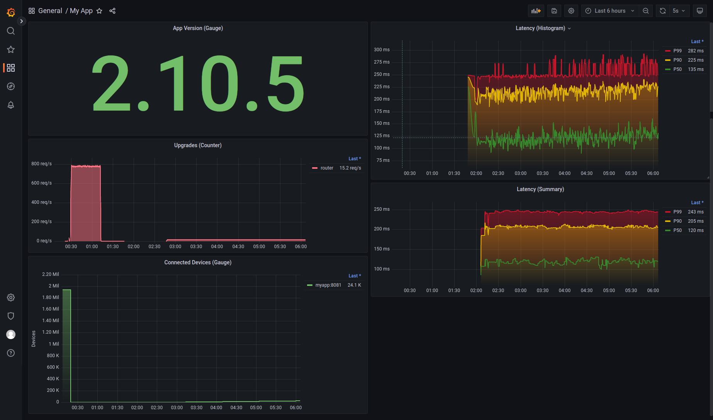

# Golang Learn Monitoring 

This is the repository I created to record everything I learned about monitoring in Golang

---

## Tech
- Golang
- Prometheus
- Grafana

## Metrics
- Counter
- Gauge
- Histogram
- Summary

## Reference
- https://www.youtube.com/watch?v=WUBjlJzI2a0